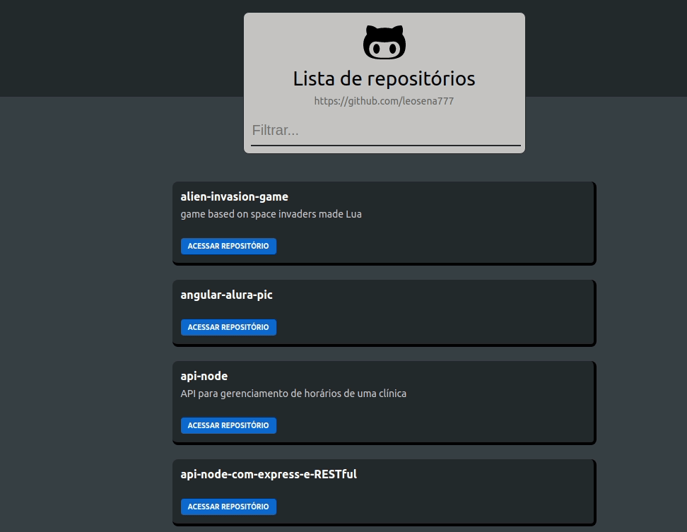

# Github Repository Explorer

## Description

Simple project in react and redux-toolkit to explore a github user's repositories

## Using

- Redux Toolkit
- Redux Thunk
- Scss
- github API

## Screen

# Redux Toolkit

Redux Toolkit is official and recommended approach for writing Redux logic. It wraps around the Redux core, and contains packages and functions that we think are essential for building a Redux app. Redux Toolkit builds in our suggested best practices, simplifies most Redux tasks, prevents common mistakes, and makes it easier to write Redux applications.

RTK includes utilities that help simplify many common use cases, including store setup, creating reducers and writing immutable update logic, and even creating entire "slices" of state at once.

[📚 Documentation](https://redux.js.org/redux-toolkit/overview)
